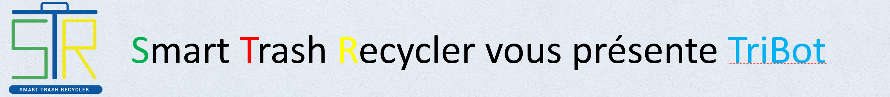
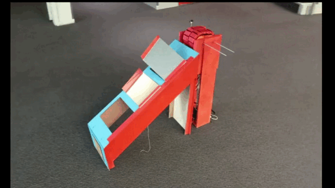

<h1 align="center">
  
</h1>

---

# TRIBOT

## Petit résumé

- Tribot est une poubelle qui permet de trier les déchets de manière efficace dans un contexte environnemental selon des critères spécifiques. Elle s’adresse notamment à des professionnels soucieux de l’environnement, aux grandes surfaces, aux institutions publiques et aux entreprises. Un modèle de taille réduite sera destiné aux ménages.

## Objectifs

- Tri des déchets.
- Régler les problèmes d’esthétisme.
- Régler les problèmes d'odeurs.
- Gain de temps conséquent.

## Techno

- Arduino

## Résultat

## Auteur

- [@Anthony](https://github.com/Cyd-des-Tenebres)
- [@Pierre](https://github.com/Pierre-Portfolio)
- [@OeTroV](https://github.com/OeTroV)
